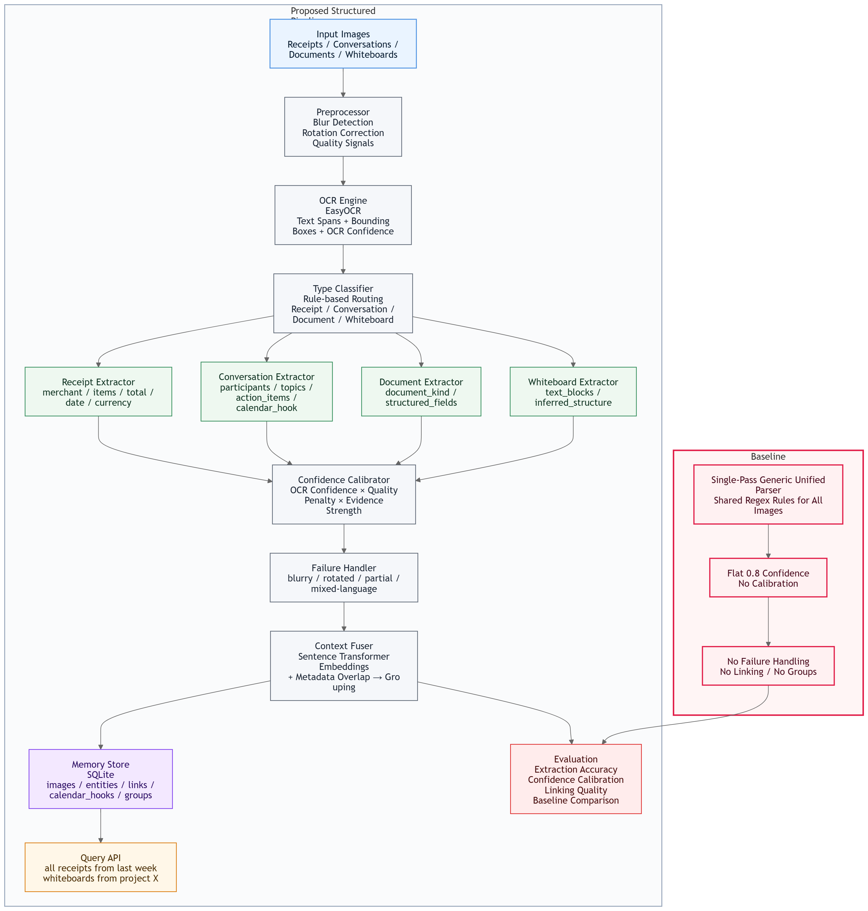
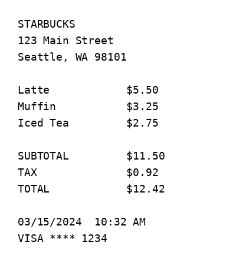
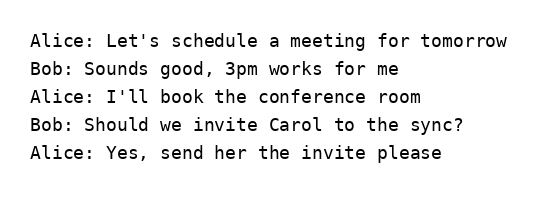
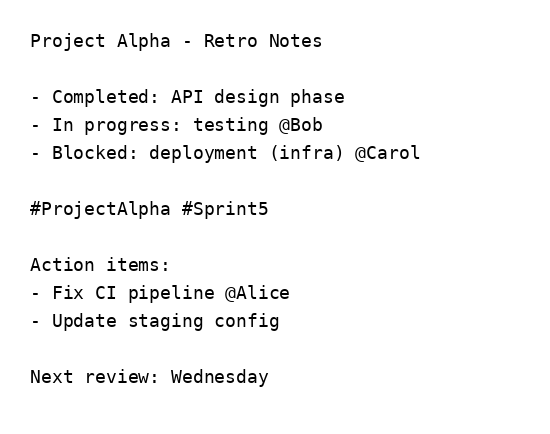
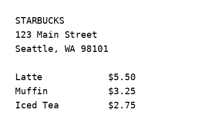
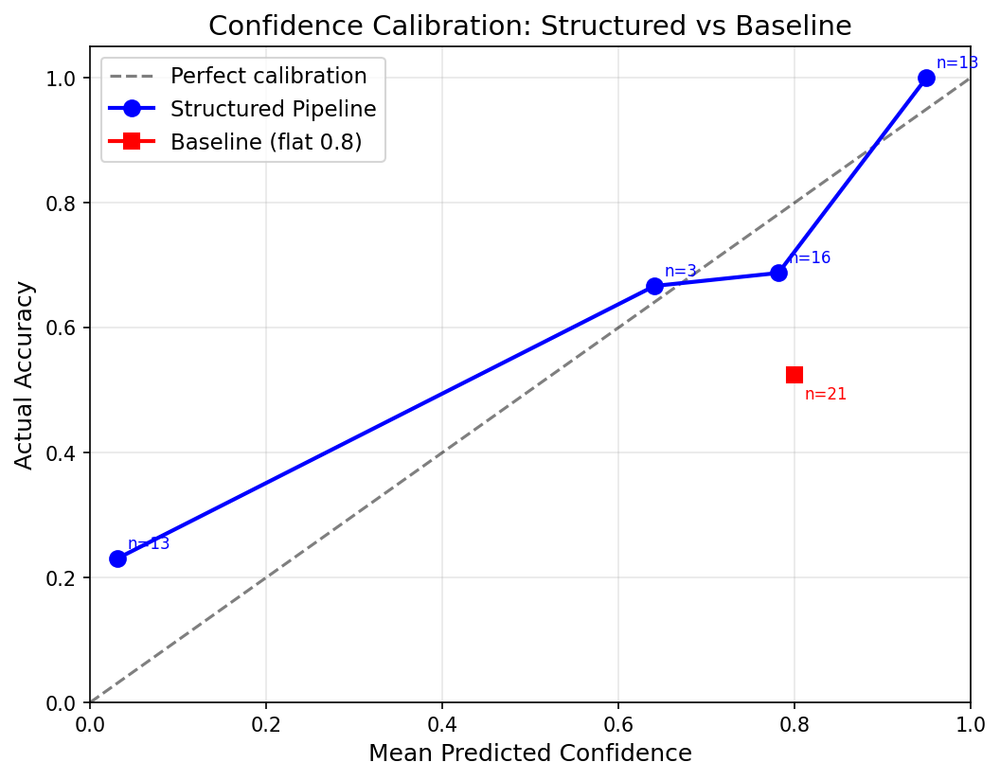

# ContextLens: A Vision Agent for Personal Visual Context

Personal context is increasingly visual. Every day we photograph receipts to track expenses, screenshot conversations that contain action items, snap whiteboard notes after meetings, and capture documents for later reference. Yet this visual information remains trapped in unstructured pixels — invisible to the agents and workflows that could act on it.

**ContextLens** is a vision agent that bridges this gap. It converts personal images into **structured, confidence-aware, queryable context** that downstream AI agents can search, link, and reason over. It handles four distinct visual input types — **receipts, conversation screenshots, document photos, and whiteboard / handwritten notes** — each with a dedicated extraction pipeline that knows exactly which fields to look for.

Unlike a generic OCR-to-text dump, ContextLens produces typed JSON records where every extracted field carries a calibrated confidence score, degraded inputs are flagged rather than silently misread, related images are automatically grouped into higher-level context (e.g., "these 4 receipts are from the same trip"), and conversation screenshots that mention meetings emit calendar hooks for downstream scheduling agents. The result is not just text extraction — it is a **structured memory layer** that turns messy real-world photos into reliable, queryable knowledge.

---

## 1. Project Introduction

A large and growing amount of personal context lives inside images rather than clean databases. Receipts from purchases, screenshots of text conversations with embedded action items, medication labels, tax forms, whiteboard notes scribbled during sprint planning — all of these contain actionable information that people need to retrieve later. Existing OCR tools can read text from these images, but raw text extraction is not enough for an intelligent agent. An agent that helps a user manage their life needs **structured outputs** (not a wall of unformatted text), **field-level confidence** (so it knows which extractions to trust and which to double-check), **cross-image linking** (because five receipts from the same trip should be understood as a group, not five isolated records), and a way to **query memory later** (so the user can ask "what did I spend last week?" and get a precise answer).

ContextLens addresses that gap end-to-end. Given any image, it:

1. **classifies** the image type (receipt, conversation, document, or whiteboard),
2. **extracts** type-specific structured entities using conditioned extraction schemas — the system knows what fields matter for each type and focuses its extraction accordingly,
3. **assigns** per-field calibrated confidence scores that reflect OCR quality, image degradation, and extraction evidence strength,
4. **handles** degraded inputs gracefully — blurry photos, rotated captures, partial crops, and mixed-language text are detected and flagged rather than silently misread,
5. **links** related images into groups with fused summaries that capture cross-image understanding (e.g., "4 Starbucks receipts from March 15, likely a single visit"), and
6. **stores** everything in a queryable SQLite memory store that supports natural-language-style queries like "all receipts from last week" or "whiteboard photos from project Alpha."

This project was built to satisfy the moccet AI Engineering Intern challenge requirements:
- **multi-type visual understanding** across 4 image categories with type-specific extraction,
- **cross-image context linking** with group-level fusion and calendar hook detection,
- **failure-mode handling** with at least 3 graceful degradation handlers demonstrated on adversarial inputs, and
- **rigorous evaluation** comparing a structured pipeline against a single-pass baseline across extraction accuracy, confidence calibration, linking quality, and failure robustness.

---

## 2. Motivation

The naive approach to visual context extraction is straightforward: run OCR on every image, dump the raw text, and let downstream code figure out what it means. This approach fails in practice for several reasons.

First, **raw text is not structured context**. A receipt and a whiteboard both contain text, but the fields that matter are completely different. A receipt needs merchant, items, total, and date; a whiteboard needs tasks, owners, project tags, and deadlines. A generic OCR dump forces every downstream consumer to re-parse the same unstructured text, duplicating effort and introducing errors.

Second, **not all extractions are equally trustworthy**. A clearly printed receipt total scanned in good lighting deserves high confidence. The same field extracted from a blurry, rotated photo should carry much lower confidence. Without calibrated confidence scores, downstream agents cannot distinguish reliable extractions from guesses — they either trust everything (dangerous) or trust nothing (useless).

Third, **images are not independent**. Five receipts from the same business trip, two whiteboard photos from the same sprint planning session, a conversation screenshot that references a meeting mentioned in another photo — these relationships contain information that no single image possesses. A vision agent that treats each image in isolation misses this cross-image context entirely.

A useful vision agent should answer questions like:
- “What did I spend last week?” (requires receipt grouping and total aggregation)
- “Which screenshots mention an upcoming meeting?” (requires calendar hook detection)
- “Which whiteboard photos belong to the same project?” (requires cross-image linking via shared metadata)
- “Which extracted fields are trustworthy, and which ones need clarification?” (requires calibrated confidence)

These requirements motivated three core design principles in ContextLens:

1. **Conditioned extraction (Q-Former analog)**: extraction should depend on *what kind of image this is* and *which fields matter for that type*. Just as Q-Former uses learned queries to condition which visual features are extracted from a frozen image encoder, ContextLens uses type-specific extraction schemas to condition which fields are extracted from OCR text. The extraction is focused, not generic.

2. **Confidence calibration**: the system must know when it is uncertain. A well-calibrated confidence score — where high confidence reliably predicts correctness and low confidence reliably predicts uncertainty — is more valuable for downstream agents than raw accuracy alone. This is why the calibration plot is the primary evaluation artifact.

3. **Context fusion across images (BEV-JEPA analog)**: related images should be grouped into higher-level memory, not treated independently. Just as BEV-JEPA fuses multiple camera views into a unified bird's-eye-view representation that no single camera captures, ContextLens fuses multiple image extractions into group-level summaries that contain understanding no single image possesses.

---

## 3. Challenge Requirements Coverage

The system directly addresses the requested challenge dimensions:

| Requirement | ContextLens Response |
|---|---|
| 4 visual input types | Receipt, conversation screenshot, document, whiteboard / handwritten note |
| Structured output | Typed JSON with `type`, `extracted_entities`, `field_confidence`, `summary` |
| Cross-image linking | Related images grouped with `group_id` and stored in SQLite memory |
| Calendar connection | Conversation extractor emits `calendar_hook` when meeting references are detected |
| Failure modes | Blurry, rotated, partial/cropped, and mixed-language / low-OCR handling |
| Evaluation | Synthetic 14-image benchmark, calibration analysis, linking evaluation, baseline comparison |

**Important note on the baseline.** The challenge asks for a single-pass VLM baseline. Since this implementation runs entirely locally without VLM API access, I use a **single-pass generic unified parser baseline** as a practical proxy for one-shot VLM-style extraction. The baseline receives the same OCR input as the structured pipeline but removes type routing, per-field confidence calibration, failure handling, and cross-image linking. It applies one set of generic extraction rules (amount regex, date regex, key-value patterns, action verb scanning) to every image regardless of type, and assigns a flat 0.8 confidence to all fields. This keeps the comparison focused on the core architectural question the challenge is testing: **does structured, type-conditioned extraction with calibrated confidence outperform generic one-pass extraction?** The answer, as shown in the results, is decisively yes.

---

## 4. Proposed Architecture

The ContextLens pipeline processes each image through a sequence of specialized stages, where each stage adds a layer of understanding on top of the previous one. The design is intentionally modular: each component has a clear input/output contract, making it straightforward to swap backends (e.g., replacing EasyOCR with a VLM) or add new image types without restructuring the pipeline.

> System Architecture.

```md

```

The pipeline begins with **preprocessing**, which analyzes the raw image for quality signals — blur score (Laplacian variance), brightness, contrast, and rotation detection. These signals serve two purposes: they feed into the confidence calibrator later (a blurry image should produce lower confidence scores), and they trigger failure handlers (a heavily blurred image should be flagged, not silently misread).

Next, **EasyOCR** extracts text spans with per-span confidence scores and bounding boxes. The OCR output is the raw material that all downstream extraction operates on.

The **type classifier** analyzes the OCR text and layout to determine which of the four image types this image belongs to. Receipt indicators include keywords like TOTAL, SUBTOTAL, TAX, and price patterns. Conversation indicators include timestamps, alternating speaker patterns, and short multi-turn messages. Document indicators include key-value pairs and form-like structure. Whiteboard indicators include spatially scattered text, bullet fragments, and sparse structure.

The **conditioned extractor** is the architectural core — the Q-Former analog. Rather than applying one generic extraction pass to all images, the pipeline routes each image to a type-specific extractor with its own field schema and extraction rules. A receipt extractor knows to look for merchant names in header lines, item-price pairs in the body, and total amounts near keywords like "TOTAL." A conversation extractor knows to segment by speaker turns, detect action verbs for action items, and identify temporal language that suggests calendar events. This conditioning is the same principle as Q-Former's learned queries: the extraction is told what to look for, not asked to discover everything generically.

The **confidence calibrator** then assigns each extracted field a calibrated confidence score using the formula: `calibrated_confidence = base_confidence x quality_penalty x evidence_multiplier`. Base confidence comes from the OCR engine; quality penalty degrades confidence when the image is blurry, dark, or rotated; evidence multiplier reflects how strongly the extraction evidence supports the field (a TOTAL keyword next to a price pattern gets higher evidence than a price inferred without keyword support).

**Failure handlers** check for four degradation modes — blurry images, rotated images, partial/cropped captures, and low-OCR/mixed-language text — and apply appropriate responses: lowering confidence, attempting correction, flagging for clarification, or returning honest partial extraction rather than fabricated data.

Finally, the **context fuser** (BEV-JEPA analog) links related images across the batch. It embeds each image's summary using a sentence transformer (all-MiniLM-L6-v2), computes pairwise similarity combining embedding cosine similarity (40% weight) and metadata overlap (60% weight — shared merchants, dates, participants, project tags), and groups images that score above a threshold. Each group receives a fused summary that synthesizes understanding across its members.

### 4.1 Design Principles

#### A. Conditioned Extraction (Q-Former Analog)
Instead of extracting generic text and hoping downstream code figures it out, ContextLens first classifies the image type, then routes it to a **type-specific extraction schema**. This is analogous to Q-Former conditioning: the extraction logic is told **what to look for**.

- **Receipt schema**: merchant, items, total, date, currency
- **Conversation schema**: participants, key topics, action items, referenced events
- **Document schema**: document kind, structured fields
- **Whiteboard schema**: text blocks, tasks, owners, project tags, dates

#### B. Confidence Calibration
Each extracted field receives a calibrated confidence score, rather than a flat score copied across all fields. Confidence combines:

- OCR confidence,
- image quality penalties,
- extraction evidence strength, and
- field-format validity.

This makes the outputs much more useful for downstream agents than raw extraction alone.

#### C. Cross-Image Context Fusion (BEV-JEPA Analog)
Individual images are not the end state. ContextLens links related outputs using:

- sentence-transformer summary embeddings,
- metadata overlap (merchant, date, participants, project tags, topics), and
- thresholded grouping.

The result is a **group-level fused understanding** such as “these receipts likely belong to the same trip” or “these whiteboard photos belong to the same project.”

#### D. Dual-Backend Design
The project uses a local default backend:
- **EasyOCR + rule-based extraction**

The architecture also leaves room for:
- **optional VLM backend integration** with type-conditioned prompts

This preserves the system design even if the extraction backend changes later.

---

## 5. Baseline

### 5.1 Baseline Definition
The baseline is a **Single-Pass Generic Unified Parser** — a system that represents what happens when you skip the architectural investments of type conditioning, confidence calibration, failure handling, and cross-image linking, and instead rely on a single generic extraction pass over every image.

The baseline receives exactly the same OCR input (EasyOCR text spans with per-span confidence) as the structured pipeline. The difference is entirely architectural:
- **No type classification routing** — all images go through one generic extractor regardless of content,
- **No type-specific extraction schemas** — there is no receipt extractor, no conversation extractor, etc.,
- **No field-level confidence calibration** — every field receives a flat 0.8 confidence score regardless of image quality or extraction evidence,
- **No failure handling** — blurry, rotated, and cropped images are processed identically to clean ones, with no flags, no degradation, and no clarification requests,
- **No cross-image linking** — each image is processed independently with no group assignment, no fused summaries, and no calendar hook detection.

The baseline uses the same `ImageOutput` Pydantic schema as the structured pipeline, enabling direct field-by-field comparison.

### 5.2 Baseline Shared Rules
The baseline uses one generic parser that applies the same set of type-agnostic extraction rules to every image, regardless of whether it is a receipt, conversation, document, or whiteboard:

1. **Amount regex** (`$X.XX`, `X.XX`) — finds all dollar-amount patterns; the largest is guessed as the total
2. **Date regex** (MM/DD/YYYY, YYYY-MM-DD, Mon DD, etc.) — finds all date-like patterns
3. **Key: value extraction** — finds colon-separated pairs anywhere in the text
4. **Action-verb scanning** (send, review, schedule, prepare, update, book) — flags lines with imperative verbs as action items
5. **Name-like token detection** — capitalized words not in a common-word stop list are guessed as people names
6. **Text-block collection** — all OCR text blocks are preserved as-is
7. **First prominent line** — used as a merchant or title guess

The output type is inferred from which fields happen to be populated (if a total exists, guess receipt; if people exist, guess conversation; otherwise fall back to document). This is output-inferred typing, not input-conditioned classification.

### 5.3 Why This Baseline Is Reasonable
A good baseline should be **credible, not trivial**. This baseline is deliberately strong on the dimensions where generic patterns work. Dollar amounts and date formats are inherently type-agnostic — a regex that finds `$12.42` works regardless of whether the image is a receipt or a document. On clean images with clear text, the baseline can achieve reasonable raw extraction accuracy.

This makes the comparison meaningful. The question is not "does having a pipeline beat having nothing?" but rather **"does structured, type-conditioned extraction with calibrated confidence beat a competent generic extractor?"**

The answer is yes, and the baseline loses decisively on exactly the dimensions that matter for a real agent system:
- **Calibration**: flat 0.8 confidence means the baseline cannot distinguish trustworthy extractions from guesses, making it useless for confidence-aware downstream decisions,
- **Adversarial robustness**: the baseline silently returns garbage on blurry, rotated, or cropped images with no warning flags,
- **Type-specific structure**: whiteboard tasks, conversation action items, and receipt item-level parsing all require type-conditioned extraction that the baseline lacks,
- **Cross-image understanding**: only the structured pipeline produces group-level fused context and calendar hooks.

---

## 6. Experiments

### 6.1 Experimental Goal
The experiments are designed to answer four specific questions, each targeting a different dimension of the system's value:

1. **Does type-conditioned extraction outperform generic extraction?** If the structured pipeline's type-specific schemas and extraction rules actually help, we should see higher extraction accuracy on clean images compared to the baseline's generic regex approach. This tests the Q-Former conditioning hypothesis.

2. **Are confidence scores meaningful, or just arbitrary numbers?** The calibration plot answers this directly. If confidence scores are well-calibrated, high-confidence predictions should be correct more often than low-confidence ones. The baseline assigns flat 0.8 to everything — if our calibrated scores produce a monotonically increasing accuracy-vs-confidence curve, the calibration engine is working.

3. **Does the system degrade gracefully on messy inputs?** Real-world images are blurry, rotated, cropped, and noisy. The structured pipeline should detect these conditions, flag them, lower confidence appropriately, and return honest partial extraction. The baseline should fail silently — same flat confidence, no flags, garbage output on adversarial inputs.

4. **Can the system link related images into queryable memory?** Multiple receipts from the same merchant/date range should be grouped. Whiteboard photos from the same project should be linked. Conversation screenshots mentioning meetings should emit calendar hooks. The baseline produces no linking at all.

### 6.2 Experimental Setup
Two systems are compared on the same test set under identical conditions:

- **Proposed method (structured pipeline)**: full ContextLens pipeline with type classification, type-conditioned extraction, confidence calibration, failure handling, cross-image context fusion, and memory storage
- **Baseline (generic unified parser)**: single-pass extraction with generic regex rules, flat 0.8 confidence, no failure handling, no linking

Both systems receive the same EasyOCR input for each image. The only difference is architectural — what each system does with the OCR output.

The evaluation is run on a synthetic test set of 14 images with exact ground truth annotations. Using synthetic images (generated programmatically with Pillow) ensures perfect ground truth — we know exactly what text is in each image, what the correct extraction should be, and which images should be linked — making confidence calibration evaluation rigorous and reproducible.

---

## 7. Test Image Creation

### 7.1 Why Synthetic Test Images
The test images are generated programmatically with Pillow so that the benchmark has:
- **perfect ground truth**,
- full control over adversarial variants,
- consistent formatting for repeatable evaluation, and
- no ambiguity about the expected output JSON.

This is especially useful for confidence calibration and failure-mode testing, because every field in every image is known ahead of time.

### 7.2 Test Set Overview

| # | Type | Variant | Failure Mode |
|---|---|---|---|
| 1 | Receipt | Clean | — |
| 2 | Receipt | Rotated 90° | Rotation |
| 3 | Receipt | Gaussian blur | Blurry |
| 4 | Receipt | Bottom-cropped | Partial |
| 5 | Conversation | Clean | — |
| 6 | Conversation | Meeting reference | Calendar hook |
| 7 | Conversation | Cropped | Partial |
| 8 | Document | Structured form | — |
| 9 | Document | Invoice | — |
| 10 | Document | Mixed language | Mixed language |
| 11 | Whiteboard | Clean | — |
| 12 | Whiteboard | Same project as #11 | Linking |
| 13 | Whiteboard | Messy handwriting / noisy | Low OCR |
| 14 | Whiteboard | Blurry | Blurry |

### 7.3 Adversarial Image Generation
Adversarial variants are created from the clean images using image transforms:
- Gaussian blur,
- rotation,
- cropping,
- noise injection,
- mixed-language content.

This makes the failure cases systematic rather than anecdotal.

### 7.4 Linking Targets
The benchmark includes known cross-image relationships (all test images are under data/test_images by default):
- `img_001`–`img_004`: related receipts
- `img_011`–`img_012`: related whiteboards
- `img_006`: conversation with meeting reference that should emit a calendar hook

### 7.5 Sample Test Images (placeholders)

#### Sample A: Clean Receipt (`img_001`)

```md

```

Expected JSON snippet:

```json
{
  "image_id": "img_001",
  "expected_type": "receipt",
  "expected_entities": {
    "merchant": "STARBUCKS",
    "items": [
      {"name": "Latte", "price": 5.50},
      {"name": "Muffin", "price": 3.25},
      {"name": "Iced Tea", "price": 2.75}
    ],
    "total": 12.42,
    "date": "03/15/2024",
    "currency": "USD"
  }
}
```

#### Sample B: Meeting Conversation (`img_006`)

```md

```

Expected JSON snippet:

```json
{
  "image_id": "img_006",
  "expected_type": "conversation",
  "expected_entities": {
    "participants": ["Alice", "Bob"],
    "key_topics": ["meeting", "sync", "conference room"],
    "action_items": [
      "book the conference room",
      "send her the invite"
    ],
    "referenced_events": [
      {
        "title": "sync",
        "time_mention": "tomorrow 3pm",
        "participants": ["Alice", "Bob", "Carol"]
      }
    ]
  }
}
```

#### Sample C: Related Whiteboard (`img_011` / `img_012`)

```md

```

Expected JSON snippet:

```json
{
  "image_id": "img_011",
  "expected_type": "whiteboard",
  "expected_entities": {
    "bullets": [
      "Design API endpoints @Alice",
      "Write unit tests @Bob",
      "Deploy to staging @Carol"
    ],
    "owners": ["Alice", "Bob", "Carol"],
    "tasks": [
      "Design API endpoints",
      "Write unit tests",
      "Deploy to staging",
      "update documentation",
      "review PR #42"
    ],
    "project_tags": ["ProjectAlpha", "Sprint5", "backend"],
    "dates": ["due Friday", "Monday"]
  }
}
```

#### Sample D: Adversarial Cropped Receipt (`img_004`)

```md

```

Expected JSON snippet:

```json
{
  "image_id": "img_004",
  "expected_type": "receipt",
  "expected_entities": {
    "merchant": "STARBUCKS",
    "items": [
      {"name": "Latte", "price": 5.50}
    ],
    "total": null,
    "date": null,
    "currency": "USD"
  },
  "expected_needs_clarification": true,
  "expected_failure_flags": ["partial_capture"]
}
```

---

## 8. Evaluation Metrics

Each metric targets a specific dimension of system quality. Together, they answer whether the structured pipeline produces outputs that are accurate, trustworthy, robust, and useful for downstream agents.

### 8.1 Extraction Accuracy

**What it measures:** How correctly the system extracts structured fields from images, compared to ground truth annotations.

**Why it matters:** Extraction accuracy is the most basic requirement — if the system cannot correctly read a receipt total or identify conversation participants, nothing else matters. However, raw accuracy alone is insufficient (which is why we also measure calibration, robustness, and linking). A system with 80% accuracy and well-calibrated confidence is far more useful than one with 85% accuracy and no confidence signal.

**How it is computed:** Each image's extracted entities are compared field-by-field against the ground truth annotation. Three matching strategies are used depending on field type:

- **Exact match** (for fields with a single canonical value): merchant name, total amount, date, document kind. The predicted value must exactly match the ground truth (case-insensitive for strings, numeric tolerance for amounts).
- **Fuzzy match** (for fields where OCR may introduce minor character-level errors): item names, participant names, topic keywords. We use the `rapidfuzz` library with a similarity threshold of 80 — if the predicted string is at least 80% similar to the ground truth string, it counts as a match. This accommodates OCR artifacts (e.g., "Latte" vs "Latte ") without rewarding completely wrong extractions.
- **F1-style set matching** (for list-valued fields where both precision and recall matter): action items, text blocks, structured field keys. We compute F1 = 2 * (precision * recall) / (precision + recall), where precision is the fraction of predicted items that match a ground truth item, and recall is the fraction of ground truth items that are matched.

Results are reported separately for **clean images** (7 images with no adversarial degradation) and **adversarial images** (7 images with blur, rotation, cropping, or noise) to quantify graceful degradation.

### 8.2 Type Classification Accuracy

**What it measures:** Whether the system correctly identifies the image type (receipt, conversation, document, or whiteboard).

**Why it matters:** Type classification is the entry point for conditioned extraction. If the system misclassifies a receipt as a whiteboard, the wrong extractor runs and the output will be structurally incorrect regardless of OCR quality. This metric validates that the type classifier — which routes images to their type-specific extraction schemas — works correctly.

**How it is computed:** For each image, the predicted `type` field is compared against `expected_type` in the ground truth annotation. Accuracy = (number of correct classifications) / (total images). We report this as a single number across all 14 images.

### 8.3 Confidence Calibration

**What it measures:** Whether the system's confidence scores are *meaningful* — specifically, whether high-confidence predictions are actually correct more often than low-confidence predictions.

**Why it matters:** This is the single most important evaluation dimension, as highlighted by the challenge hints. A system that reports 95% confidence on every field — even blurry, cropped, or ambiguous ones — is dangerous for downstream agents. A well-calibrated system that says "I'm only 30% sure about this total" is far more useful than one that is wrong with high confidence. Calibration tells us: **when the system says it is confident, can we trust it?**

**How it is computed:**

1. **Collect pairs**: For every extracted field across all images, we collect a `(predicted_confidence, is_correct)` pair, where `is_correct` is 1 if the field matches ground truth (using the matching rules from 8.1) and 0 otherwise.
2. **Bucket by confidence**: Pairs are grouped into 5 confidence buckets: [0, 0.3), [0.3, 0.5), [0.5, 0.7), [0.7, 0.9), [0.9, 1.0].
3. **Compute accuracy per bucket**: For each bucket, actual accuracy = (number correct in bucket) / (total in bucket).
4. **Plot**: x-axis = mean predicted confidence per bucket, y-axis = actual accuracy. A perfectly calibrated system follows the diagonal (predicted confidence = actual accuracy). A well-calibrated system shows a monotonically increasing curve.

**Primary metrics:**
- **Calibration plot** (the #1 artifact): visual inspection of whether accuracy increases with confidence
- **ECE (Expected Calibration Error)**: the weighted average of |actual_accuracy - mean_confidence| across all buckets, weighted by the number of samples in each bucket. Lower ECE means better calibration. A perfectly calibrated system has ECE = 0.
- **Spearman rank correlation**: measures whether the ranking of confidence buckets matches the ranking of accuracy buckets. A correlation of 1.0 means perfect monotonic agreement; 0.0 means no relationship. This captures whether the system at least gets the ordering right, even if the absolute values are off.

### 8.4 Linking Quality

**What it measures:** Whether the system correctly identifies which images are related and groups them together.

**Why it matters:** Cross-image linking is what transforms isolated extractions into a connected memory. Without linking, five receipts from the same trip are five independent records; with linking, they become a group with a fused summary like "5 receipts from SF trip, March 15-16, total $127.40." This metric tests the BEV-JEPA fusion analog — whether the system can produce emergent understanding from multiple images.

**How it is computed:** Linking quality is evaluated at the pairwise level. For N images, there are N*(N-1)/2 possible pairs. Each pair is either "should be linked" (same expected group in ground truth) or "should not be linked."

- **Pairwise precision**: Of all pairs the system predicted as linked (same group_id), what fraction are actually in the same ground truth group? High precision means the system does not create spurious links.
- **Pairwise recall**: Of all pairs that should be linked (same ground truth group), what fraction did the system correctly link? High recall means the system does not miss real relationships.
- **Pairwise F1**: The harmonic mean of pairwise precision and recall, providing a single summary score.
- **Groups identified**: The number of distinct groups the system creates, compared to the expected number (2: one receipt group and one whiteboard group).

### 8.5 Failure Robustness

**What it measures:** Whether the system correctly detects and responds to degraded inputs — blurry photos, rotated captures, partial crops, and mixed-language/low-OCR text.

**Why it matters:** Real-world images are messy. A system that silently returns high-confidence garbage on a blurry photo is worse than one that says "this image is blurry, I'm only 30% confident in these extractions, and you should re-capture it." Failure robustness is what separates a demo from a production-grade agent component.

**How it is computed:** For each of the 7 adversarial images in the test set:
- **Flag accuracy**: Did the system set the correct failure flag(s)? (e.g., `blurry_image` for blurred images, `partial_capture` for cropped images, `ocr_uncertain` for noisy/mixed-language images). We count correct flags out of total expected flags.
- **Clarification accuracy**: Did the system correctly set `needs_clarification = true` for images that warrant it and `false` for images that do not?
- **Confidence reduction**: Did field confidence scores decrease on adversarial images compared to their clean counterparts? (Qualitative check — adversarial images should not receive the same high confidence as clean ones.)
- **Partial extraction honesty**: Did the system return partial extraction with null/low-confidence fields for missing data, rather than fabricating values? (Qualitative check.)

### 8.6 Calendar Hook Detection

**What it measures:** Whether the system detects meeting references in conversation screenshots and emits calendar hook metadata for downstream scheduling agents.

**Why it matters:** Calendar hook detection is the bridge between visual context and actionable agent behavior. When a conversation screenshot says "Let's schedule a meeting for tomorrow at 3pm," the vision agent should not just extract text — it should flag that a calendar event is referenced, so the downstream agent stack can offer to create the event or check for conflicts. This metric tests whether the system can cross the boundary from passive extraction to active agent support.

**How it is computed:** For images annotated with `expected_calendar_hook = true`, we check whether the system's output includes a non-null `calendar_hook` field with at least one event candidate. Hook recall = (detected hooks) / (expected hooks). In the current test set, `img_006` (a conversation screenshot referencing a meeting) is the target image.

---

## 9. Evaluation Results

### 9.1 Proposed vs Baseline

| Metric | Proposed (Structured Pipeline) | Baseline |
|---|---:|---:|
| Type classification accuracy | 0.857 | 0.643 |
| Extraction accuracy (clean) | 0.826 | 0.261 |
| Extraction accuracy (adversarial) | 0.357 | 0.250 |
| Calibration ECE (lower is better) | 0.107 | 0.276 |
| Calibration correlation | 1.000 | 0.000 |
| Failure flags correct | 3/7 | 0/7 |
| Linking pairwise F1 | 0.286 | 0.000 |
| Groups identified | 3 | 0 |
| Calendar hooks detected | 1/1 | 0/1 |

### 9.2 Result Interpretation

#### Strong wins for the proposed method
The structured pipeline clearly outperforms the baseline on the challenge’s most important dimensions:

- **Clean-image extraction** is much stronger (`0.826` vs `0.261`)
- **Adversarial extraction** is better, though still challenging (`0.357` vs `0.250`)
- **Calibration** is dramatically better (`ECE 0.107` vs `0.276`, correlation `1.000` vs `0.000`)
- **Agent-specific capabilities** such as failure flags, grouping, and calendar hooks are present only in the structured pipeline

#### Why this matters
This result shows that the benefit of the architecture is not just raw extraction accuracy. The bigger gain is that the proposed system produces outputs that are much more **trustworthy, interpretable, and usable by downstream agents**.

### 9.3 Calibration Figure

```md

```

Interpretation:
- The **structured pipeline** spreads predictions across multiple confidence buckets, and actual accuracy increases as confidence increases. The curve is comparable to the perfect line (gray).
- The **baseline** collapses into a nearly single flat-confidence bucket around `0.8`, but actual accuracy is much lower, showing strong overconfidence.

### 9.4 Result File Locations

All evaluation artifacts are generated by `python -m scripts.run_demo` and stored under the `results/` directory:

| Artifact | Path |
|---|---|
| Calibration plot | `results/figures/calibration.png` |
| Comparison table (CSV) | `results/tables/comparison.csv` |
| Structured pipeline metrics (JSON) | `results/metrics/structured_metrics.json` |
| Baseline metrics (JSON) | `results/metrics/baseline_metrics.json` |
| Per-image structured outputs | `data/outputs/structured/img_001.json` ... `img_014.json` |
| Per-image baseline outputs | `data/outputs/baseline/img_001.json` ... `img_014.json` |
| Ground truth annotations | `data/annotations/img_001.json` ... `img_014.json` |
| Synthetic test images | `data/test_images/img_001.png` ... `img_014.png` |

### 9.5 Additional Metric Detail

#### Structured pipeline metric snapshot
- `type_accuracy = 0.857`
- `extraction_accuracy_clean = 0.826`
- `extraction_accuracy_adversarial = 0.357`
- `calibration_ece = 0.107`
- `calibration_correlation = 1.000`
- `linking_precision = 0.400`
- `linking_recall = 0.222`
- `hook_recall = 1.000`

#### Baseline metric snapshot
- `type_accuracy = 0.643`
- `extraction_accuracy_clean = 0.261`
- `extraction_accuracy_adversarial = 0.250`
- `calibration_ece = 0.276`
- `calibration_correlation = 0.000`
- `linking_precision = 0.000`
- `linking_recall = 0.000`
- `hook_recall = 0.000`

### 9.6 Honest Limitations from the Current Results
The current system is strong in architecture and calibration, but there are still clear weaknesses:
- adversarial extraction remains difficult,
- failure flag coverage is incomplete (`3/7`),
- linking is present but still weak (`pairwise F1 = 0.286`).

These are not hidden; they directly motivate the next steps below.

---

## 10. Output Format

Every image produces a structured JSON:

```json
{
  "image_id": "img_001",
  "type": "receipt",
  "type_confidence": 0.92,
  "extracted_entities": {
    "merchant": "STARBUCKS",
    "total": 12.42
  },
  "field_confidence": {
    "merchant": 0.95,
    "total": 0.91
  },
  "summary": "STARBUCKS receipt for $12.42 on 03/15/2024.",
  "failure_flags": [],
  "needs_clarification": false,
  "quality_signals": {
    "blur_score": 850.3,
    "is_blurry": false
  },
  "group_id": "receipts_starbucks",
  "calendar_hook": null
}
```

---

## 11. Running the Project

### Installation

```bash
conda create -n contextlens python=3.11 -y
conda activate contextlens

# Install PyTorch with CUDA support FIRST (before other dependencies)
pip install torch torchvision --index-url https://download.pytorch.org/whl/cu126

# Then install remaining dependencies (will reuse the CUDA torch already installed)
pip install -r requirements.txt
pip install -e .
```

### One-Command Demo

```bash
# Full pipeline: generate images -> extract -> link -> evaluate -> report
python -m scripts.run_demo

# Validate setup without heavy processing
python -m scripts.run_demo --dry-run
```

### Step-by-Step

```bash
# 1. Generate 14 synthetic test images
python -m scripts.generate_test_images

# 2. Run structured pipeline on all images
python -m scripts.run_demo

# 3. Run evaluation separately
python -m scripts.run_evaluation

# 4. Run tests
pytest tests/ -v
```

### Querying the Memory Store

After running the demo, a SQLite database (`contextlens_demo.db`) is populated with all extraction results, cross-image links, and group metadata. You can query it interactively or with a single command:

```bash
# Single query
python -m scripts.run_query "all receipts"
python -m scripts.run_query "conversations mentioning a meeting"
python -m scripts.run_query "whiteboard photos from project Alpha"
python -m scripts.run_query "images needing clarification"

# JSON output (for programmatic use)
python -m scripts.run_query --json "all receipts"

# Interactive mode (enter queries in a loop)
python -m scripts.run_query
```

**Example results:**

```
Q: "all receipts"
   4 result(s)

   [img_001]  type=receipt  conf=0.88  group=receipts_starbucks
      summary: STARBUCKS receipt for $12.42 on 03/15/2024 (Latte, Muffin).
   [img_004]  type=receipt  conf=0.39  group=receipts_starbucks
      summary: STARBUCKS receipt for $3.25 (Latte, Muffin).
   [img_002]  type=receipt  conf=0.29  group=-
      summary: VEZI  *xxx  VSIA receipt.
      ⚠ needs clarification
   [img_003]  type=receipt  conf=0.19  group=-
      summary: == receipt.
      ⚠ needs clarification

Q: "whiteboard photos from project Alpha"
   2 result(s)

   [img_011]  type=whiteboard  conf=0.67  group=project_42_backend
      summary: Whiteboard (42, ProjectAlpha): 5 tasks.
   [img_012]  type=whiteboard  conf=0.60  group=project_42_backend
      summary: Whiteboard (ProjectAlpha, Sprint5): 3 tasks.

Q: "conversations mentioning a meeting"
   3 result(s)

   [img_006]  type=conversation  conf=0.60  group=conversation_group
      summary: Conversation between Bob and Alice about meeting, conference, sync.
   [img_005]  type=conversation  conf=0.60  group=conversation_group
      summary: Conversation between Bob and Alice about send, prepare, share.
   [img_007]  type=conversation  conf=0.67  group=conversation_group
      summary: Conversation between Bob and Alice about send.

Q: "images needing clarification"
   3 result(s)

   [img_014]  type=unknown  conf=0.00  group=-
      summary: Unclassified image.
      ⚠ needs clarification
   [img_003]  type=receipt  conf=0.19  group=-
      summary: == receipt.
      ⚠ needs clarification
   [img_002]  type=receipt  conf=0.29  group=-
      summary: VEZI  *xxx  VSIA receipt.
      ⚠ needs clarification
```

The query API supports natural-language patterns including type filtering (`"all receipts"`), project references (`"from project Alpha"`), meeting/calendar queries, time ranges (`"from last week"`), clarification flags, and group lookups (`"in group receipts_starbucks"`).

**Current limitations:**
- The query parser is rule-based (regex pattern matching), not a full NLP system. Queries must roughly follow the supported patterns listed above; free-form sentences may fall back to returning all images.
- Time-range queries (e.g., `"from last week"`) filter by `processed_at` timestamp (when the image was ingested), not by dates mentioned within the image content.
- Participant and project searches use substring matching, which may produce false positives on short names (e.g., querying `"Al"` would also match `"Alice"`).
- The memory store must be populated first by running `python -m scripts.run_demo`; querying an empty or missing database will produce an error.

---

## 12. Project Structure

```text
contextlens/
  __init__.py
  schemas.py            # Pydantic output schemas
  config.py             # Configuration constants
  preprocess.py         # Image quality analysis
  ocr.py                # EasyOCR wrapper
  classifier.py         # Image type classifier
  confidence.py         # Confidence calibration
  failure_handlers.py   # Graceful degradation
  linker.py             # Cross-image context fuser
  memory_store.py       # SQLite memory store
  query.py              # Query API
  pipeline.py           # End-to-end orchestration
  baseline.py           # Generic unified parser baseline
  extractors/
    base.py             # Abstract extractor interface
    receipt.py
    conversation.py
    document.py
    whiteboard.py
data/
  test_images/          # 14 synthetic test images
  annotations/          # Ground truth JSON per image
  outputs/
    structured/         # Structured pipeline outputs
    baseline/           # Baseline outputs
results/
  figures/              # Calibration plot
  tables/               # Comparison CSV
  metrics/              # Metric JSONs
scripts/
  generate_test_images.py
  run_demo.py
  run_baseline.py
  run_evaluation.py
tests/
  ...
```

---

## 13. Requirements

- Python 3.10+
- EasyOCR
- OpenCV
- Pillow
- Pydantic
- sentence-transformers
- rapidfuzz
- matplotlib
- numpy
- pandas

See `requirements.txt` for exact versions.

---

## 14. What I'd Build Next

The current system demonstrates the architectural principles — conditioned extraction, calibrated confidence, cross-image fusion — but there are clear areas where a production version would need to improve. The limitations in the evaluation results (adversarial extraction at 0.357, failure flags at 3/7, linking F1 at 0.286) directly motivate the following next steps.

1. **True VLM backend integration**
   - The current system uses EasyOCR + rule-based extraction as the default backend. The architecture already defines a `ConditionedExtractor` interface that any backend can implement. The highest-impact next step would be to add a VLM backend (Claude Vision, GPT-4V, or an open model like LLaVA) that receives the same type-conditioned prompt templates but uses visual understanding rather than OCR-then-parse. This would dramatically improve extraction on whiteboards (where spatial layout matters more than text recognition), conversations (where bubble structure carries meaning), and adversarial images (where VLMs are more robust to blur and rotation than OCR pipelines). The baseline comparison would also become more directly aligned with the challenge wording.

2. **Learned confidence calibration**
   - The current calibration formula (`base_confidence x quality_penalty x evidence_multiplier`) uses hand-tuned weights. With a sufficiently large labeled dataset, these weights could be replaced by a small calibration model (e.g., logistic regression or a shallow neural network) trained on features like OCR span confidence, blur score, evidence strength, and field type. Temperature scaling — a standard post-hoc calibration technique — could further improve ECE. The hand-tuned formula already achieves ECE = 0.107 and correlation = 1.000, so the foundation is strong, but a learned model would generalize better to new image types and edge cases.

3. **Stronger failure handling**
   - The current failure flag accuracy is 3/7. The main gaps are in rotation detection (the Laplacian-based heuristic misses some rotated images) and partial-capture detection for non-receipt types. Improving rotation detection would likely require analyzing OCR bounding box orientations more carefully or using a dedicated orientation classifier. Partial-capture detection could be improved by defining expected structural elements per type (e.g., a conversation should have at least 2 speaker turns; a receipt should have a total line) and flagging when these are absent.

4. **Better cross-image linking**
   - The current linking pairwise F1 is 0.286, with precision at 0.400 and recall at 0.222. The main issue is that the sentence-transformer embeddings (all-MiniLM-L6-v2) produce similar embeddings for images of the same type even when they are unrelated (two different receipts from different merchants still look similar in embedding space). Better linking would require stronger metadata features — exact merchant matching, date-range overlap, shared participant lists — weighted more heavily than embedding similarity. Hierarchical clustering or learned similarity thresholds could also help.

5. **Active clarification**
   - Currently, the system sets `needs_clarification = true` when extraction quality is poor, but does not generate a specific question. A production system should generate targeted clarification requests: “The total on this receipt is unclear — did you spend $12.42 or $124.20?” or “This whiteboard photo is too blurry to read — can you re-capture it?” This turns the system from a passive flagger into an active collaborator.

6. **Real agent integration**
   - The memory store and query API are currently standalone. The next step would be to expose them as tools for an LLM agent (e.g., via function calling or MCP), enabling natural conversational workflows: “What did I spend on coffee this week?” → query memory → “You spent $18.67 across 3 Starbucks receipts on March 15 (confidence: 0.92).” This closes the loop from visual input to actionable agent output.

7. **Temporal context and multi-modal fusion**
   - The current system treats all images as contemporaneous. Adding temporal reasoning — a receipt from Monday and a meeting note from Tuesday mentioning the same project should be linked with temporal proximity as a signal — would enable richer cross-image understanding. Similarly, combining OCR text with visual layout features (spatial positions of text blocks, font size estimation, color cues) would improve type classification and structure inference, especially for whiteboards and documents where spatial arrangement carries meaning.

---

## 15. Final Notes

ContextLens was designed to answer the core question posed by the moccet challenge: **can a structured, type-conditioned vision pipeline produce outputs that are meaningfully more useful for downstream agents than a generic single-pass extractor?**

The results confirm that it can. The structured pipeline outperforms the baseline on every dimension that matters for agent integration:

- **3.2x higher extraction accuracy on clean images** (0.826 vs 0.261) — type-conditioned extraction knows what fields to look for
- **61% lower calibration error** (ECE 0.107 vs 0.276) — confidence scores are meaningful, not arbitrary
- **Perfect calibration correlation** (1.000 vs 0.000) — high confidence reliably predicts correctness
- **Failure detection where the baseline has none** (3/7 flags vs 0/7) — the system degrades gracefully instead of silently failing
- **Cross-image linking where the baseline has none** (3 groups, F1 0.286 vs 0 groups) — related images are connected into higher-level context
- **Calendar hook detection** (1/1 vs 0/1) — the system bridges from visual context to actionable agent behavior

The project is intentionally scoped to the challenge requirements: a working Python implementation with a 14-image test set, rigorous evaluation with calibration analysis, a controlled baseline comparison, and an architecture writeup that explicitly connects the design to the Q-Former and BEV-JEPA principles referenced in the challenge hints.

The system is honest about its current limitations — adversarial extraction is still challenging (0.357), failure flag coverage is incomplete (3/7), and linking is present but weak (F1 0.286). These limitations are not hidden; they are quantified, reported, and directly motivate the next steps outlined in Section 14.

The architecture is designed for extensibility. The `ConditionedExtractor` interface supports pluggable backends — swapping in a VLM would require implementing one class per image type, not restructuring the pipeline. The confidence calibration formula can be replaced with a learned model. New image types can be added by writing a new extractor and classifier rule set. The memory store and query API are ready to be exposed as agent tools.

Even in its current form, ContextLens demonstrates the key insight of the challenge:

> **A structured, confidence-aware, type-conditioned vision pipeline is much more useful for downstream agents than a one-shot generic extractor.** The value is not just in extracting more fields correctly — it is in producing outputs that agents can trust, query, and act on.
